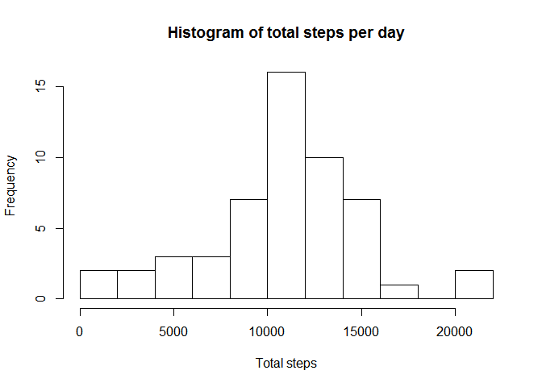
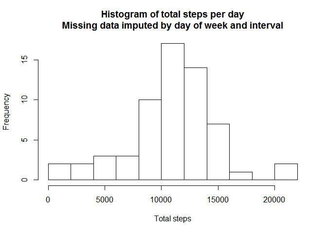
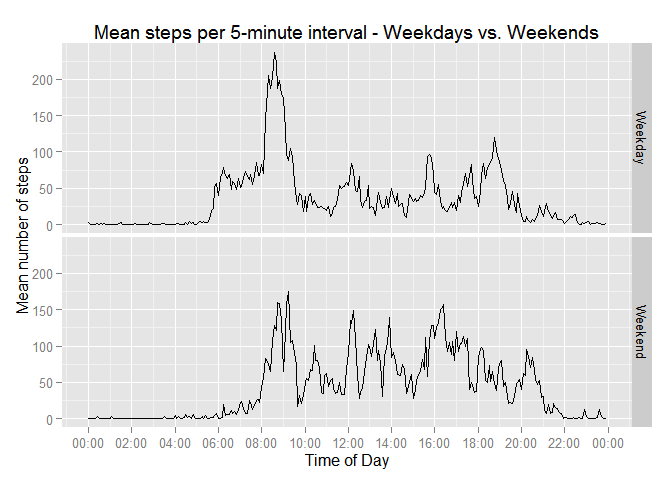

# Reproducible Research: Peer Assessment 1
Daniel Nordlund  
`r format(Sys.time(), '%B %d, %Y')`  


## Loading and preprocessing the data


```r
## unzip project data and read it in
## unzip('./activity.zip')
activity <- read.csv('activity.csv', stringsAsFactors = FALSE)

## create date/time variable 
library(lubridate)
activity$datetime <- with(activity, ymd_hm(paste(date, interval%/%100, interval%%100, sep=':')))

## time_of_day is a "hack" to ease aggregating and plotting the data with ggplot2
## any calendar date could have been chosen for this, but for a variety of reasons I chose
## the R/Unix epoch start date
activity$time_of_day <- with(activity, ymd_hm(paste('1970-01-01', interval%/%100, interval%%100, sep=':')))
```

## What is mean total number of steps taken per day?

```r
## identify rows where values of steps is missing
na.index <- is.na(activity$steps)

steps <- activity$steps[!na.index]
activity_date <- activity$date[!na.index]
total_steps_perday <- aggregate(steps, by=list(activity_date), FUN=sum)

hist(total_steps_perday[,2], breaks=8, main='Histogram of total steps per day', xlab='Total steps')
```

 

```r
steps_summary <- summary(total_steps_perday[,2])
sprintf('Mean = %7.1f and Median = %7.1f', steps_summary['Mean'], steps_summary['Median'])
```

```
## [1] "Mean = 10770.0 and Median = 10760.0"
```

## What is the average daily activity pattern?

```r
## plot time series of total steps within time periods
## averaged over days
time_of_day <- activity$time_of_day[!na.index]
df <- aggregate(steps, by=list(time_of_day), FUN=mean)
plot(df$Group.1,df$x, type='l', main='Mean steps per 5-minute interval across days', xlab='Time of day', ylab='Mean number of steps')
```

 

```r
## which interval had the maximum mean number of steps across all days
max_interval <- df[which.max(df$x),"Group.1"]
sprintf('Interval with maximum mean number of steps began at %s', format(max_interval,'%H:%M'))
```

```
## [1] "Interval with maximum mean number of steps began at 08:35"
```

## Imputing missing values

```r
## how much missing data is there?
percent_missing <- sum(is.na(activity$steps)) / nrow(activity) * 100
sprintf('Percent of intervals where variable "steps" was NA: %5.1f', percent_missing)
```

```
## [1] "Percent of intervals where variable \"steps\" was NA:  13.1"
```

```r
## impute the the mean value for the same time interval and day of week
day_of_week <- wday(activity$datetime[!na.index])
imputation_df <- aggregate(steps, by=list(time_of_day, day_of_week), FUN=mean)
activity$day_of_week <- wday(activity$datetime)
imputed_activity <- merge(activity, imputation_df, by.x=c('day_of_week','time_of_day'), 
                          by.y=c('Group.2', 'Group.1'), all.x=TRUE) 
imputed_activity$steps <- ifelse(is.na(imputed_activity$steps), imputed_activity$x, imputed_activity$steps)
imputed_activity <- imputed_activity[order(imputed_activity$datetime),]

imputed_total_steps_perday <- aggregate(imputed_activity$steps, by=list(imputed_activity$date), FUN=sum)

hist(imputed_total_steps_perday[,2], breaks=8, main='Histogram of total steps per day\nMissing data imputed by day of week and interval', xlab='Total steps')
```

 

```r
imp_steps_summary <- summary(imputed_total_steps_perday[,2])
sprintf('Mean = %s and Median = %s', imp_steps_summary['Mean'], imp_steps_summary['Median'])
```

```
## [1] "Mean = 10820 and Median = 11020"
```


## Are there differences in activity patterns between weekdays and weekends?

```r
## 
library(ggplot2)
library(scales)
imputed_activity$weekday <- ifelse(imputed_activity$day_of_week %in% c(1,7), 'Weekend', 'Weekday')
df <- aggregate(imputed_activity$steps, by=list(imputed_activity$weekday,imputed_activity$time_of_day), FUN=mean)
qplot(Group.2, x, data=df, facets = Group.1 ~ ., geom=c('line'), xlab="Time of Day", ylab='Mean number of steps') + scale_x_datetime(breaks=date_breaks('2 hour'), labels=date_format('%H:%M')) +
labs(title='Mean steps per 5-minute interval - Weekdays vs. Weekends')
```

 

